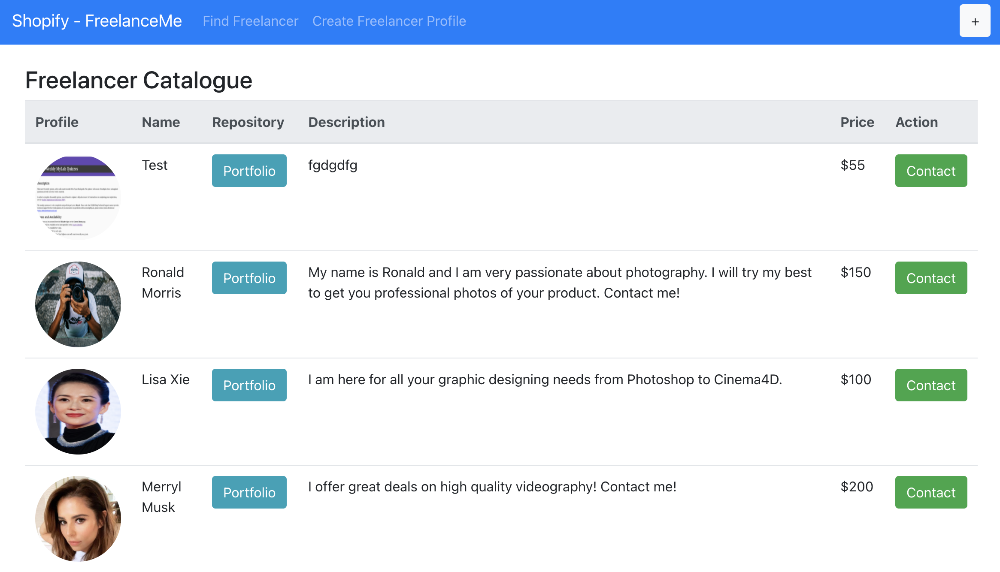
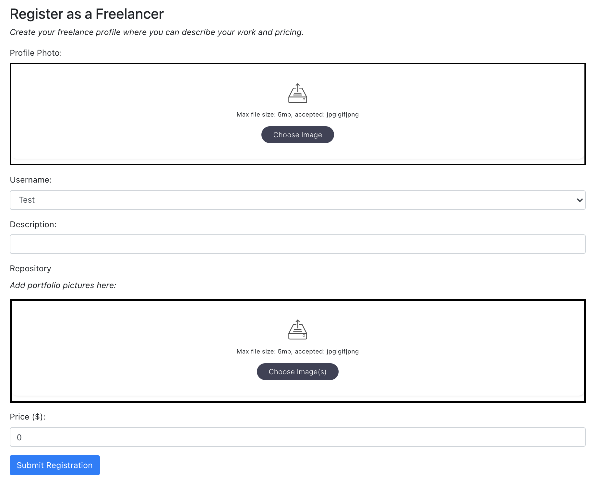
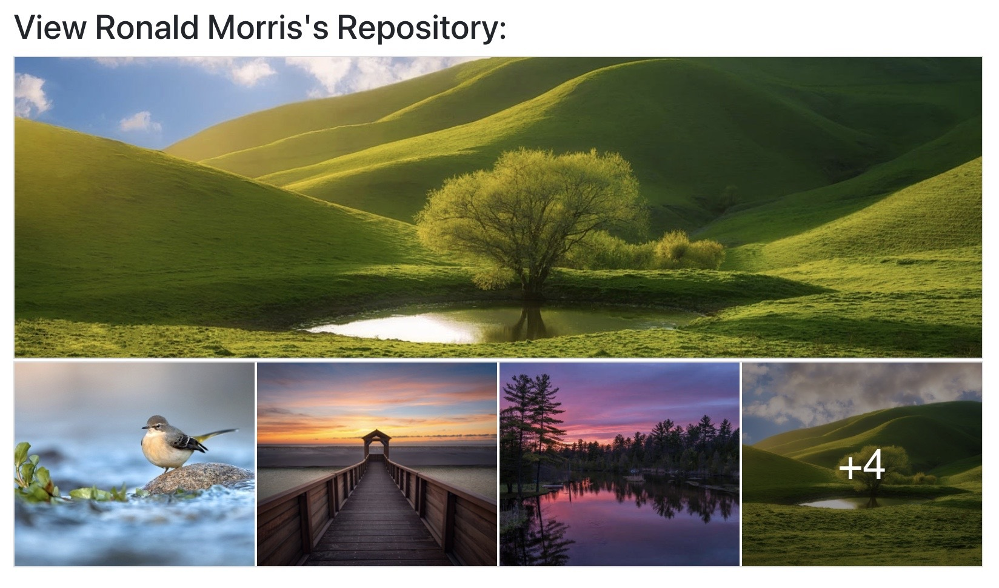
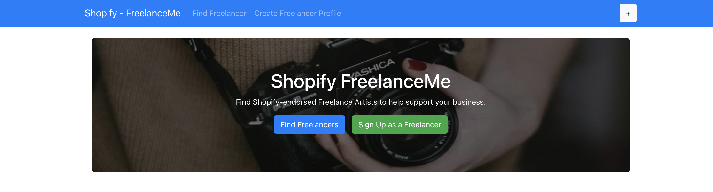

# ShopifyFreelanceArtists (Incl. Image Repository)
MERN-based web application that allows Shopify merchants to find and hire Freelance Artists to help them take pictures of their products, design their websites, build professional graphics etc. This service will allow freelance artists to sign up, describe their work, state their price, and provide an image repository of their work for potential shopify merchants. This tool can be used with other Shopify services that helps businesses streamline creating an online presence for themselves. 

Created as a part of Shopify's Backend Developer Internship Application. The portfolio section which allows Freelancers to upload images of their work acts as an image repository.

## Installation
Once you've clone the repo, in your terminal run:

```bash
npm install
```

After this, within the backend directory, create a .env file and fill it out as such:
```bash
ATLAS_URI = #Enter MongoDB Atlas URI
```

The back-end server can be run by using the following command within the backend directory:
```bash
nodemon start
```

The front-end server can be run using the following command within the repository directory:
```bash
nodemon start
```

# Demo

## Catalogue View



## Freelancer Creation Form



## Freelancer Porfolio or Image Repository



## Homepage


